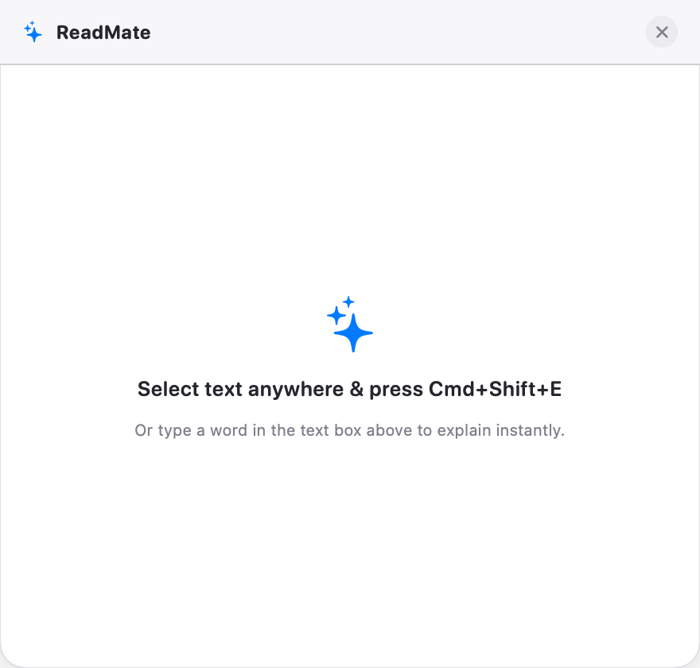
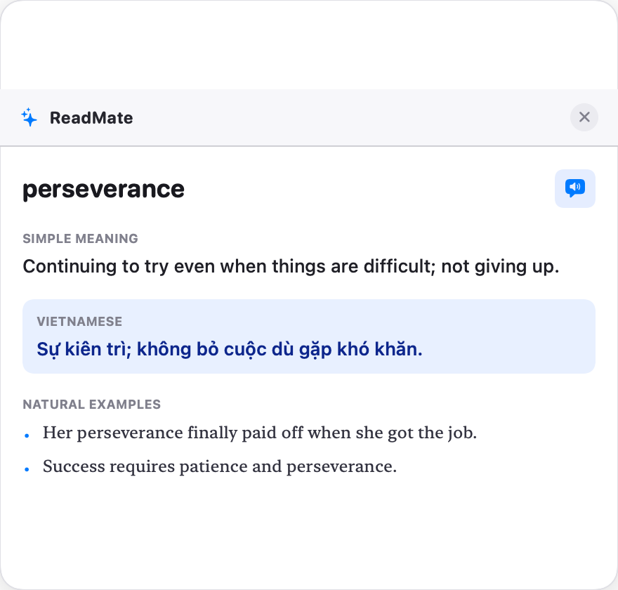

<p align="center">
  
</p>

<h1 align="center">ReadMate</h1>

<p align="center">
  A native macOS menu-bar app that <strong>instantly explains any text you select</strong>.
  <br>
  Built with Swift & SwiftUI. Free. Open source.
</p>

<p align="center">
  <a href="https://github.com/kenzot25/read-mate/releases"></a>
  <a href="#install"></a>
  <a href="LICENSE"></a>
</p>

---

## How it works

Select a word, phrase, or sentence in **any app** — ReadMate pops up with the meaning, Vietnamese translation, vocabulary breakdown, grammar notes, and natural examples.

### Empty state

<p align="center">
  
</p>

### Explaining a word

<p align="center">
  
</p>

### Floating sparkles button

<p align="center">
  
</p>

## Features

| Feature | Description |
|---------|-------------|
| **Instant explain** | Select text anywhere, press `Cmd+Shift+E` (or click the floating sparkles button) |
| **Vietnamese translation** | Every lookup includes a Vietnamese meaning (via Cambridge English-Vietnamese Dictionary) |
| **English-English mode** | Switch to pure English definitions from Cambridge Dictionary |
| **Vocabulary breakdown** | Key words extracted and explained individually |
| **Grammar insights** | Sentence structure, pronunciation, and verb conjugation |
| **Natural examples** | Real-world usage examples with Vietnamese translations |
| **AI-powered** | Uses Google Gemini for deep explanations (free API key from Google AI Studio) |
| **Offline fallback** | Cambridge Dictionary scraping works without any API key |
| **Native macOS** | Menu bar agent, no Dock icon, feels right at home |

## Install

### Download

Grab the latest `.dmg` from [Releases](https://github.com/kenzot25/read-mate/releases), open it, and drag ReadMate to your Applications folder.

### Bypass Gatekeeper (first launch only)

ReadMate is not signed with an Apple Developer certificate, so macOS will block it on first launch. Choose **one** of these methods:

**Method 1 — System Settings (recommended)**

1. Try to open ReadMate — you'll see a warning
2. Open **System Settings** → **Privacy & Security**
3. Scroll down — you'll see a message about ReadMate being blocked
4. Click **Open Anyway**
5. Confirm when prompted

**Method 2 — Right-click**

1. In Finder, go to **Applications**
2. **Right-click** (or Control-click) ReadMate → choose **Open**
3. Click **Open** in the dialog

**Method 3 — Terminal (one command)**

```bash
xattr -cr /Applications/ReadMate.app
```

After bypassing Gatekeeper once, ReadMate opens normally forever.

### Build from source

Requires macOS 15 (Sequoia) and Xcode Command Line Tools.

```bash
git clone https://github.com/kenzot25/read-mate.git
cd read-mate
make dmg
```

The DMG will be at `build/ReadMate-0.1.1.dmg`.

## Setup

1. Launch ReadMate — a sparkles icon appears in your menu bar
2. Grant **Accessibility** permission when prompted (needed to read selected text)
3. (Optional) Right-click the menu bar icon → **Settings** → add your Gemini API key for AI-powered explanations
4. (Optional) Switch Dictionary Mode between English-English and English-Vietnamese in Settings

## Usage

| Action | How |
|---|---|
| Explain selected text | Select text in any app, press `Cmd+Shift+E` |
| Quick explain | Select text, click the floating sparkles button that appears |
| Type manually | Left-click the menu bar icon, enter text in the input bar |
| Open settings | Right-click the menu bar icon → Settings |
| Switch dictionary mode | Settings → English-English or English-Vietnamese |

## Tech Stack

- **Swift / SwiftUI** — Native macOS app
- **Swift Package Manager** — No Xcode project, pure SPM
- **SwiftSoup** — HTML scraping for Cambridge Dictionary
- **Google Gemini API** — AI explanations (optional)
- **Cambridge Dictionary** — Free English-English and English-Vietnamese definitions
- **macOS Keychain** — Secure API key storage
- **Accessibility API** — Read text selection from other apps

## Project Structure

```
Sources/ReadMate/
├── Main.swift                    # App entry point, menu bar, hotkey
├── Models/
│   ├── AITemplate.swift          # Prompt templates for AI
│   └── WordLookup.swift          # Data models
├── Services/
│   ├── AIService.swift           # Gemini AI integration
│   ├── DictionaryService.swift   # Cambridge Dictionary scraper
│   ├── HistoryService.swift       # Local lookup history
│   ├── HotKeyManager.swift        # Global keyboard shortcut
│   ├── KeychainManager.swift      # macOS Keychain wrapper
│   ├── PreferencesManager.swift # Settings persistence
│   └── SelectionService.swift     # Accessibility text selection
└── UI/
    ├── HUDView.swift              # Main popup container
    ├── ExplainView.swift          # Explanation content
    ├── FloatingPanel.swift        # NSPanel subclass
    ├── FloatingSelectionButton.swift # Cursor-following button
    ├── SettingsPanelView.swift     # Settings panel wrapper
    ├── SettingsView.swift          # Settings content
    └── VisualEffectView.swift      # NSVisualEffectView wrapper

Tests/ReadMateTests/              # Unit + E2E tests
```

## Testing

```bash
swift test
```

Includes unit tests for models, preferences, dictionary parsing, and E2E tests that call real APIs.

## License

MIT
